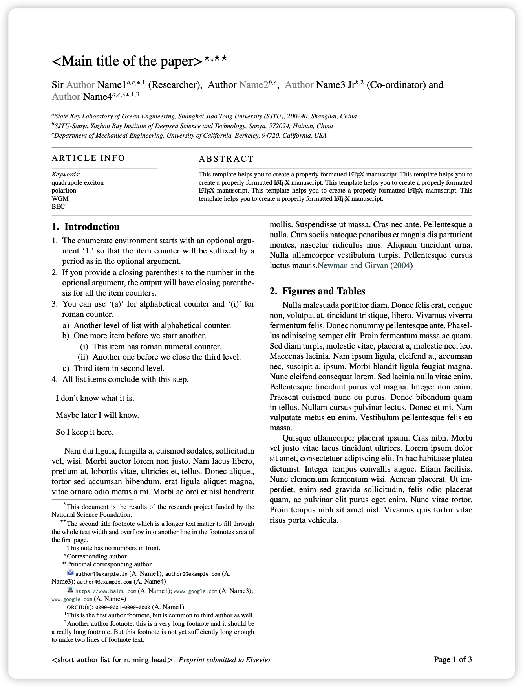
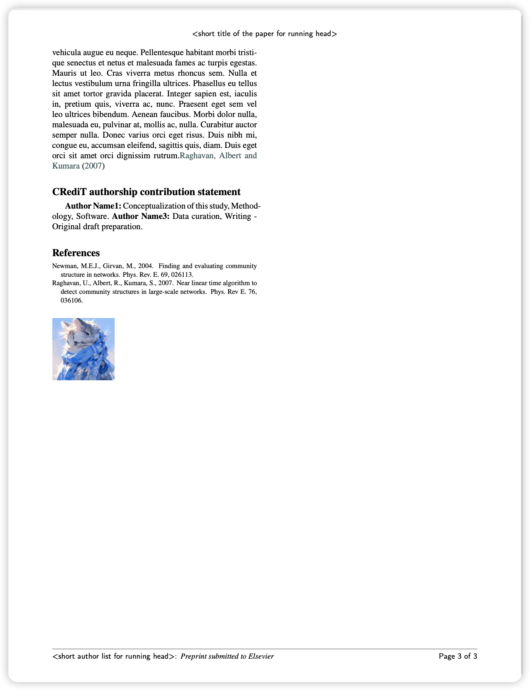

# Elsevier's cas-sc and cas-dc class files

## Official Instructions

This bundle provides two classfiles, namely cas-sc.cls and cas-dc.cls and corresponding template files for typesetting journal articles supposed to go through Elsevier's updated workflow. cas-sc.cls is meant for one-column, the other cas-dc.cls for two-column layout. These are now accepted for submitting articles both in Elsevier's electronic submission system and elsewhere.

Bugs and problems with classfiles may be reported to the
developers of the class via <elsarticle@stmdocs.in>.

The file manifest.txt provides a list of the files in the elsarticle-cas bundle.  The following are the main files available:

- cas-sc.cls, classfile to typeset article in single column
- cas-dc.cls, classfile to typeset article in double column
- cas-sc-template.tex, template file for single column journals
- cas-dc-template.tex, template file for double column journals
- cas-common.sty, additional macro package for formatting
- cas-model2-names.bst, BibTeX style file
- cas-refs.bib, sample BibTeX database
- cas-twitter.jpeg, cas-linkedin.jpeg, cas-url.jpeg, cas-gplus.jpeg, 
  cas-facebook.jpeg, cas-email.jpeg - thumbnail images of social 
  networking sites

The PDF documentation elsdoc-cas.pdf is in the doc directory.  To generate it:

 1. pdflatex elsdoc-cas
 2. pdflatex elsdoc-cas
 3. pdflatex elsdoc-cas

or

use the makefile. Use the target `all' (eg: make all) in doc directory.

The above procedure will create a print version, namely elsdoc-cas.pdf.

Copyright 2019-2021, Elsevier. Bugs, feature requests, suggestions and comments may be mailed to <elsarticle@stmdocs.in>. cas-sc.cls, cas-dc.cls related documentations and supporting packages are released under the LATEX Project Public Licence, either version 1.2 or any later version. This work has the LPPL maintenance status 'author-maintained'.

## SYD Instructions

I have modified the original template to be more suitable to directly use. The modified template is in the `Elsevier_MWE` folder. (**Only for two-columns template, and you can modify the single-column one in the same way**)

### Remarks

1. According to the official documentation, all files needed to be used when compiling should be placed in the same root directory. This rule can be found in the `doc/EM_PM_LaTeX_Guide.pdf` file.
2. Everyone new to this template is suggested to read the `doc/EM_PM_LaTeX_Guide.pdf` and `elsdoc-cas.pdf` files to understand how to use the template.
3. `PDFLaTeX -> BibTeX -> PDFLaTeX -> PDFLaTeX` is the recommended compilation order.

### Changes

1. I add some comments to the original template to make it easier to understand. The comments are in the `Elsevier_MWE/cas-dc-template.tex` file.
2. I have subtly modified the `cas-dc-template.cls` file to be more suitable for direct use and to eliminate the warning: `Package hyperref: Ignoring empty anchor.`

### Results

Here is the compiled PDF file of the modified template: 

